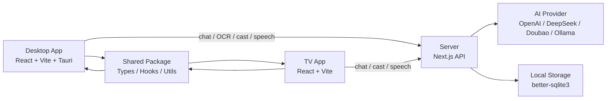

# Drama Buddy

[](https://pnpm.io/)
[](https://turbo.build/repo)
[](https://nextjs.org/)
[](https://react.dev/)
[](https://tauri.app/)
[](#快速开始)

Drama Buddy 是一个面向“看剧陪伴”场景的多端应用仓库，提供：

- 桌面端悬浮窗：边看剧边和 AI 聊剧情，支持语音输入、截图 OCR、宠物养成
- TV 端界面：大屏聊天、遥控器 / D-pad 导航、多设备 Cast 同步
- 服务端：提供聊天、知识库、宠物、OCR、语音、Cast 等 API
- 共享包：统一维护跨端类型、Hook 和公共逻辑

这是一个 `pnpm` monorepo，适合本地联调桌面端、TV 端和服务端。

## 快速开始

如果你想尽快把项目跑起来，按下面 5 步即可：

1. 克隆仓库并安装依赖
2. 配置 `apps/server/.env.local`
3. 配置 `apps/tv/.env.local`
4. 启动服务端 `pnpm dev:server`
5. 按需启动 TV 端或桌面端

最短命令路径：

```bash
git clone git@github.com:myan1aha/drama-buddy.git
cd drama-buddy
pnpm install
cp apps/server/.env.example apps/server/.env.local
cp apps/tv/.env.example apps/tv/.env.local
```

服务端最小环境变量示例：

```env
AI_PROVIDER=openai
OPENAI_API_KEY=sk-your-key-here
AI_MODEL=gpt-4o-mini
VISION_MODEL=gpt-4o-mini
```

TV 端最小环境变量示例：

```env
VITE_SERVER_URL=http://localhost:3000
```

启动服务：

```bash
pnpm dev:server
pnpm --filter @drama-buddy/tv dev
```

如果你还要启动桌面端：

```bash
pnpm --filter @drama-buddy/desktop tauri:dev
```

启动成功后：

- 服务端默认访问 `http://localhost:3000`
- TV 端默认访问 `http://localhost:5173`
- 桌面端会以 Tauri 窗口形式启动

## 架构图

下面先放一版 README 可直接渲染的架构图占位符，方便 GitHub 首页快速说明系统结构。



如果后面你想替换成正式版架构图，推荐两种方式：

- 继续保留 Mermaid，直接把上面的模块和链路细化
- 输出为图片并放到 `docs/images/architecture.png`

图片占位写法示例：

```md
## 架构图


```

## 截图预览

当前仓库还没有放入正式产品截图，下面先保留占位说明，后续可以替换成真实界面素材。

建议至少准备以下 3 张截图：

- 桌面端悬浮窗主界面
- TV 端聊天 / 看剧界面
- 桌面端 OCR 或 Cast 联动场景

占位写法示例：

```md
## Screenshots

### Desktop Widget


### TV Experience


### OCR And Cast

```

如果你后面准备补真实截图，建议统一放到：

- `docs/images/desktop-widget.png`
- `docs/images/tv-experience.png`
- `docs/images/ocr-cast.png`

也可以先在 README 中保留文字占位，避免空链接：

- `[待补] 桌面端悬浮窗截图`
- `[待补] TV 端看剧界面截图`
- `[待补] OCR / Cast 联动截图`

## 项目结构

```text
drama-buddy/
├─ apps/
│  ├─ server/   # Next.js 服务端，提供 API 和流式聊天能力
│  ├─ desktop/  # React + Vite + Tauri 桌面端
│  └─ tv/       # React + Vite TV 端
├─ packages/
│  └─ shared/   # 共享类型、Hook、工具方法
└─ e2e/         # Playwright 端到端测试
```

## 核心能力

- AI 看剧聊天：结合剧情上下文和知识库生成回答
- 流式响应：服务端通过 SSE 持续返回 token / 状态事件
- 截图 OCR：桌面端可截取当前画面并发起识别与分析
- 语音输入：支持语音转文本后直接发起对话
- Cast 同步：桌面端 / 手机端可以向 TV 端推送事件
- 宠物系统：聊天、语音等行为可驱动宠物成长

## Roadmap

下面是当前比较适合公开展示的一版路线图，后续可以随着项目进展持续调整。

### Near Term

- [ ] 补齐真实产品截图与正式架构图
- [ ] 优化 README 首页展示，增加更多使用示例
- [ ] 完善 TV 端焦点导航和看剧场景交互细节
- [ ] 提升桌面端 OCR 与语音输入的稳定性
- [ ] 补充更多剧情知识库内容与覆盖范围

### Mid Term

- [ ] 完善 Cast 多设备协同体验
- [ ] 补充更多自动化测试与端到端场景覆盖
- [ ] 优化宠物系统成长反馈和视觉表现
- [ ] 增强服务端配置能力，支持更多 AI / ASR Provider 组合
- [ ] 提升共享 Hook 和跨端契约的可维护性

### Long Term

- [ ] 增加用户配置、偏好和持久化能力
- [ ] 提供更完整的剧集上下文管理和推荐能力
- [ ] 探索移动端或更多终端形态接入
- [ ] 建立更完整的 CI / 发布流程
- [ ] 进一步打磨成可长期维护的多端产品原型

## 技术栈

- Monorepo: `pnpm workspace` + `turbo`
- Server: `Next.js` + `better-sqlite3`
- Desktop: `React` + `Vite` + `Tauri` + `Rust`
- TV: `React` + `Vite`
- Testing: `Jest` + `Playwright`

## 环境要求

建议先准备以下环境：

- Node.js `20+`
- `pnpm@9`
- Git

如果你需要运行桌面端，还需要：

- Rust toolchain
- Tauri 本地开发环境

说明：

- 仓库统一使用 `pnpm`，不要混用 `npm` 或 `yarn`
- TV 端依赖服务端地址配置
- 服务端默认跑在 `3000` 端口，TV 端默认跑在 `5173` 端口

## 安装步骤

### 1. 克隆仓库

```bash
git clone git@github.com:myan1aha/drama-buddy.git
cd drama-buddy
```

### 2. 安装依赖

```bash
pnpm install
```

### 3. 配置服务端环境变量

将 `apps/server/.env.example` 复制为 `apps/server/.env.local`：

```bash
cp apps/server/.env.example apps/server/.env.local
```

至少需要补充：

- `AI_PROVIDER`
- `OPENAI_API_KEY`
- `AI_MODEL`
- `VISION_MODEL`

常见最小配置示例：

```env
AI_PROVIDER=openai
OPENAI_API_KEY=sk-your-key-here
AI_MODEL=gpt-4o-mini
VISION_MODEL=gpt-4o-mini
```

如果你需要语音识别，还可以继续配置：

- `ASR_PROVIDER`
- `ASR_API_KEY`
- `DOUBAO_ASR_APP_ID`

### 4. 配置 TV 端服务地址

将 `apps/tv/.env.example` 复制为实际环境文件，例如：

```bash
cp apps/tv/.env.example apps/tv/.env.local
```

然后把 `VITE_SERVER_URL` 改成你本机可访问的服务端地址：

```env
VITE_SERVER_URL=http://localhost:3000
```

如果 TV 端运行在另一台设备上，需要把它改成你电脑的局域网 IP，例如：

```env
VITE_SERVER_URL=http://192.168.1.100:3000
```

## 启动方式

### 只启动服务端

```bash
pnpm dev:server
```

启动后可访问：

- Server 首页：[http://localhost:3000](http://localhost:3000)

### 启动整个工作区

```bash
pnpm dev
```

说明：

- 该命令会通过 `turbo` 启动各子项目的 `dev` 脚本
- 是否全部成功启动，取决于本机是否具备对应运行环境

### 单独启动 TV 端

```bash
pnpm --filter @drama-buddy/tv dev
```

启动后可访问：

- TV 端页面：[http://localhost:5173](http://localhost:5173)

### 单独启动桌面端

先确保服务端已经启动，再执行：

```bash
pnpm --filter @drama-buddy/desktop tauri:dev
```

桌面端特点：

- 默认通过 `http://localhost:3000` 访问服务端
- 支持悬浮窗、置顶、截图识别、语音输入、宠物系统等能力

## 常用命令

```bash
pnpm install
pnpm dev
pnpm dev:server
pnpm build
pnpm test
pnpm test:e2e
pnpm test:e2e:ui
```

按子项目运行：

```bash
pnpm --filter @drama-buddy/server dev
pnpm --filter @drama-buddy/server test
pnpm --filter @drama-buddy/tv dev
pnpm --filter @drama-buddy/desktop dev
pnpm --filter @drama-buddy/desktop tauri:dev
```

## 测试

### 单元测试

服务端包含 Jest 测试：

```bash
pnpm --filter @drama-buddy/server test
```

### 端到端测试

Playwright 会自动启动服务端和 TV 端：

```bash
pnpm test:e2e
```

如果你想打开 Playwright UI：

```bash
pnpm test:e2e:ui
```

## Contributing

欢迎继续完善这个项目。为了让多端协作更顺畅，建议遵循下面这些约定。

### 基本流程

1. 从最新 `main` 拉取代码
2. 新建功能分支
3. 完成改动后执行最小必要验证
4. 提交代码并推送分支
5. 发起 PR 或继续在本地迭代

示例：

```bash
git checkout main
git pull
git checkout -b feat/your-change
```

### 提交前建议

- 优先做小步提交，避免一次改动跨越太多模块
- 变更 API 或跨端事件时，先更新 `packages/shared`
- 修改 TV 端时，注意 D-pad 焦点和遥控器交互
- 修改 Desktop 端原生能力时，同时检查 Tauri 配置、Rust 命令和前端调用链
- 提交前至少运行与改动范围对应的最小测试或手工验证

### 推荐验证方式

- Server 逻辑改动：`pnpm --filter @drama-buddy/server test`
- TV UI 改动：`pnpm --filter @drama-buddy/tv dev`
- Desktop 原生联动改动：`pnpm --filter @drama-buddy/desktop tauri:dev`
- 跨端流程验证：`pnpm test:e2e`

### 改动原则

- 保持 `packages/shared` 作为跨端契约的唯一来源
- 不要随意修改 SSE 事件结构，除非同步更新所有消费者
- 不要把 Tauri 专属逻辑放进共享包
- 不要把 Node-only 依赖带入浏览器侧模块

### 文档同步

如果你的改动影响了：

- 安装方式
- 环境变量
- 启动命令
- 架构关系
- 用户可见功能

请同步更新 `README.md` 或对应目录下的 `AGENTS.md`。

## 开发建议

- API 或跨端事件结构变更时，先改 `packages/shared`
- 涉及 `/api/chat` 或 `/api/cast` 时，注意 SSE 事件结构兼容性
- TV 端优先保证遥控器 / D-pad 焦点导航
- Desktop 端涉及原生能力时，要同时检查 Tauri 配置、Rust 命令和前端调用链

## 常见问题

### 1. TV 端连不上服务端

检查：

- 服务端是否已启动
- `VITE_SERVER_URL` 是否配置正确
- 如果是跨设备访问，是否使用了局域网 IP 而不是 `localhost`

### 2. 桌面端起不来

检查：

- 是否安装了 Rust toolchain
- 是否完成 Tauri 本地开发环境配置
- 服务端是否已先启动

### 3. 推送到 GitHub 失败

如果使用 SSH 远程地址，先测试：

```bash
ssh -T git@github.com
```

## License

当前仓库未单独声明 License，如需开源或对外分发，建议后续补充。
